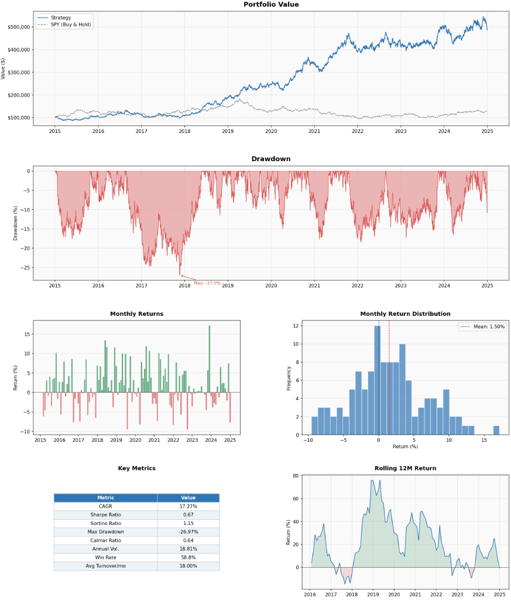

# Backtest Visualizer

A plug-and-play matplotlib dashboard for equity strategy backtests.

Pass in your own `metrics` dict and get a publication-ready chart in one call.



---

## What it generates

| Panel | Description |
|-------|-------------|
| **Equity Curve** | Portfolio value vs SPY buy & hold (normalized) |
| **Drawdown** | Underwater curve with max drawdown annotation |
| **Monthly Returns** | Bar chart colored by positive/negative |
| **Return Distribution** | Histogram of monthly returns with mean line |
| **Metrics Table** | Key performance indicators |
| **Rolling 12M Return** | 12-month rolling performance |

---

## Usage

```python
from backtest_viz import plot_results

plot_results(metrics, save_dir="outputs", benchmark_prices=spy_prices)
```

Run the included example with synthetic data:

```bash
pip install numpy pandas matplotlib
python example.py
```

---

## `metrics` dict format

| Key | Type | Description |
|-----|------|-------------|
| `portfolio_value` | `pd.Series` | Daily portfolio value, datetime-indexed |
| `drawdown_series` | `pd.Series` | Drawdown as a decimal (e.g. `-0.15` = -15%), same index |
| `monthly_returns` | `pd.Series` | Monthly returns as decimals, datetime-indexed |
| `initial_capital` | `float` | Starting capital in dollars |
| `cagr` | `float` | Compound annual growth rate (decimal) |
| `sharpe_ratio` | `float` | Annualized Sharpe ratio |
| `sortino_ratio` | `float` | Annualized Sortino ratio |
| `max_drawdown` | `float` | Maximum drawdown (decimal, negative) |
| `calmar_ratio` | `float` | CAGR / abs(max drawdown) |
| `annual_volatility` | `float` | Annualized volatility (decimal) |
| `win_rate_monthly` | `float` | Percentage of profitable months (0–100) |
| `avg_monthly_turnover` | `float` | Average monthly portfolio turnover (decimal) |

`benchmark_prices` is optional — pass a raw price `pd.Series` (e.g. SPY closes) and it will be normalized to `initial_capital` automatically.

---

## Plug in your own backtest

```python
metrics = {
    "portfolio_value":      your_pv_series,
    "drawdown_series":      your_dd_series,
    "monthly_returns":      your_monthly_ret,
    "initial_capital":      100_000,
    "cagr":                 0.142,
    "sharpe_ratio":         1.31,
    "sortino_ratio":        1.87,
    "max_drawdown":        -0.183,
    "calmar_ratio":         0.78,
    "annual_volatility":    0.118,
    "win_rate_monthly":     61.4,
    "avg_monthly_turnover": 0.22,
}

plot_results(metrics, save_dir="outputs", benchmark_prices=spy_prices)
```

Output is saved as `outputs/backtest_results.png`.
